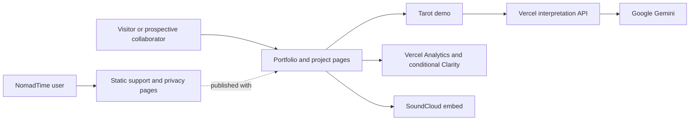
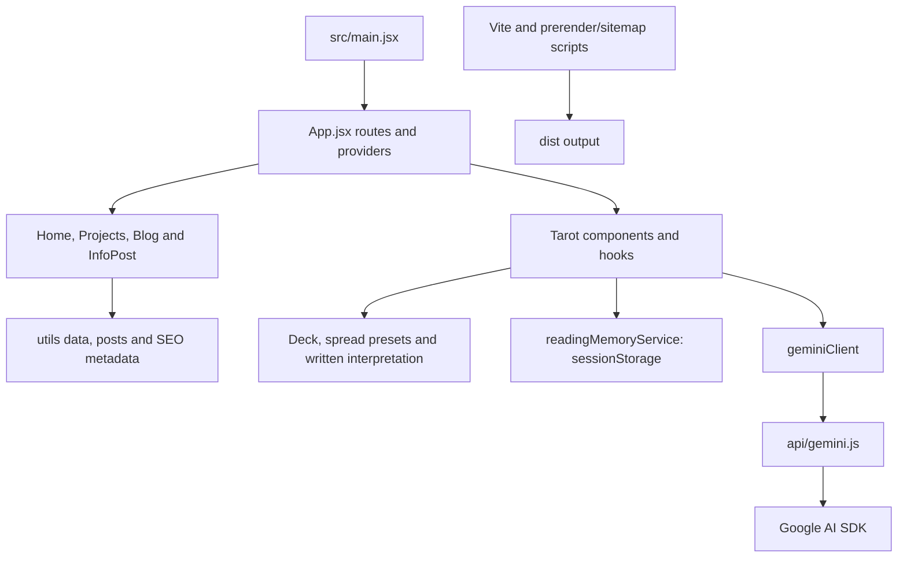
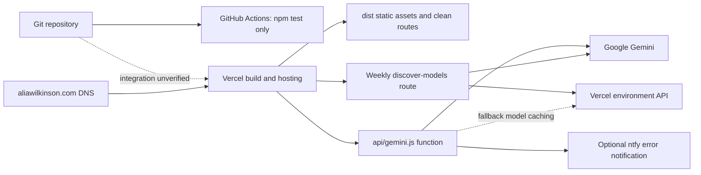
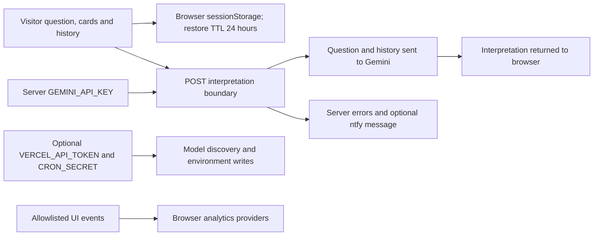

# Alia Wilkinson portfolio architecture

Product: `product:alia-wilkinson-website`. Inspected source: `f3da1a3ff3c77d4a91989acfa87b66f95510af45`. Recorded 2026-10-07 UTC (2026-10-06 US Pacific). Author: Codex source-inspection backfill; human review pending.

Authority: **source-defined/intended**, except explicitly linked **historical-receipt** or **verified** results. No live provider observation was made. Source revision applies to every unqualified view below; explicitly unmerged views use their own named revision. Record owner: Product owner; technical updates: Architect/DevOps. Next review date: **unassigned — Product owner must set before the next affected gate**.

## Business problem and critical journeys

The portfolio presents Alia's work, writing and project case studies to visitors and prospective collaborators. It also publishes NomadTime support/privacy pages and an interactive tarot demonstration. [Product context](../context.md) remains the durable narrative. The business journey is discover work → read a case study/project → find contact or support; the demo journey is draw cards → receive written interpretation → optionally ask the Gemini conversation service.

A one-hour outage blocks discovery and support links; a day disrupts referrals and app-support access; a week risks stale public information and loss of contact opportunities. Impact and criticality require Product-owner confirmation. A failure of AI interpretation should not make the static portfolio or NomadTime support pages depend on that service.

## Component and module inventory

| Canonical Component / module | Source | Delivery boundary |
| --- | --- | --- |
| `alia-wilkinson-website-web` | `src/`, `public/`, `scripts/prerender.js`, sitemap scripts | Vite `dist` static application, with prerendered pages |
| `alia-wilkinson-website-vercel` | `vercel.json`, `api/` | Hosting integration; static files plus serverless routes and configured weekly model discovery |
| `alia-wilkinson-website-gemini` | `api/gemini.js`, `api/cron/discover-models.js` | External AI service and backend-only credential |
| Portfolio route/content modules | `src/App.jsx`, `src/utils/`, components | Modules of the web Component, not separate deployables |
| Tarot reader/session memory | `src/components/Tarot/` | Browser module, local/session state; server call for AI |
| NomadTime support/privacy | `public/nomadtime/` | Static pages delivered with this site; app itself remains another Product |
| Analytics and SoundCloud adapters | `src/utils/analytics/`, music components | Browser vendor integrations; no separate canonical IDs invented |

The catalog does not separately identify each Vercel API route or cron as a Component. Their independent operational permissions should be reviewed before any future catalog change.

## System context

Authority: **source-defined**. Reviewed 2026-10-07; base source `f3da1a3ff3c77d4a91989acfa87b66f95510af45`.

## Code and module structure

Authority: **source-defined**. Reviewed 2026-10-07; base source `f3da1a3ff3c77d4a91989acfa87b66f95510af45`.

## Deployment topology

Authority: **source-defined; Vercel trigger/bindings need operator confirmation**. Reviewed 2026-10-07; base source `f3da1a3ff3c77d4a91989acfa87b66f95510af45`.

## Data flow and trust boundaries

Authority: **source-defined**. Reviewed 2026-10-07; base source `f3da1a3ff3c77d4a91989acfa87b66f95510af45`.

## Decisions, dependencies and existing evidence

`vercel.json` configures hosting/routes and a weekly cron; the checked-in workflow named Tests does only `npm ci` and `npm test`. No successful current production deploy, Vercel trigger configuration or rollback was inspected here. Static pages have no server database dependency. Gemini outages are handled with model fallback and errors, but quota, credentials and provider availability remain shared failure points.

The discovery handler only checks bearer authorization when `CRON_SECRET` is set. Both discovery and fallback-model caching can modify Vercel environment configuration when their server token is present. Treat that as a privileged management boundary: verify fail-closed authentication, least privilege, request limits and configuration-change auditing before relying on it. Server error messages/details can reach logs and optional ntfy; privacy redaction is not established by the browser analytics contract. These are source findings, not exploited or provider-tested vulnerabilities.

Use [analytics](../analytics.md), [NomadTime support documentation](../nomadtime-support-site.md), [context](../context.md) and [delivery workflow](../../AGENTIC_WORKFLOW.md). The independent Witchy Product can reuse reviewed prior art; it is not a runtime dependency here.

- Canonical [Product](https://github.com/aliawilkinson/metadataDB/blob/341ad74904954e0702ecfc79be9688597820d82d/products/alia-wilkinson-website.json) and three Component records at MetadataDB `341ad74904954e0702ecfc79be9688597820d82d`.
- Historical [Vercel deployment receipt](https://github.com/aliawilkinson/metadataDB/blob/341ad74904954e0702ecfc79be9688597820d82d/deployments/alia-wilkinson-website/portfolio-vercel-cd6uiugy5ctxtz5mendts7xxak6f.json) records source `4f90ea7ebb1904f9fd2ad5a8c93e5a1c0eff749a` at 2026-09-06T02:48:28.109Z. It does not prove deployment or health of this default branch.
- Original clean checkout on `codex/nomadtime-case-study` at `c234efb` was preserved.

See [operating procedures](operations.md), [recovery](recovery.md), [checkpoints and gaps](checklist.md) and the [backfill report](reports/2026-10-07-operating-record-backfill.md).
